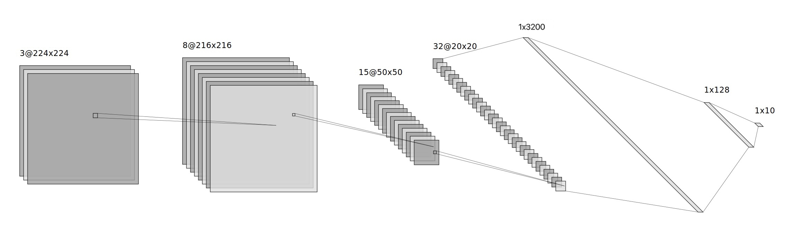
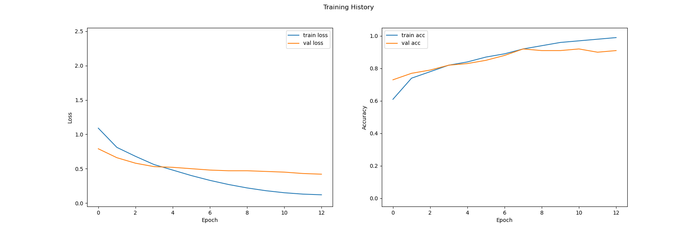
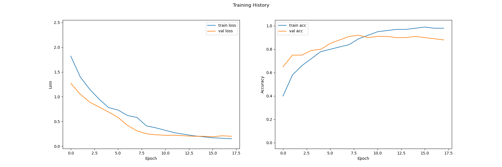
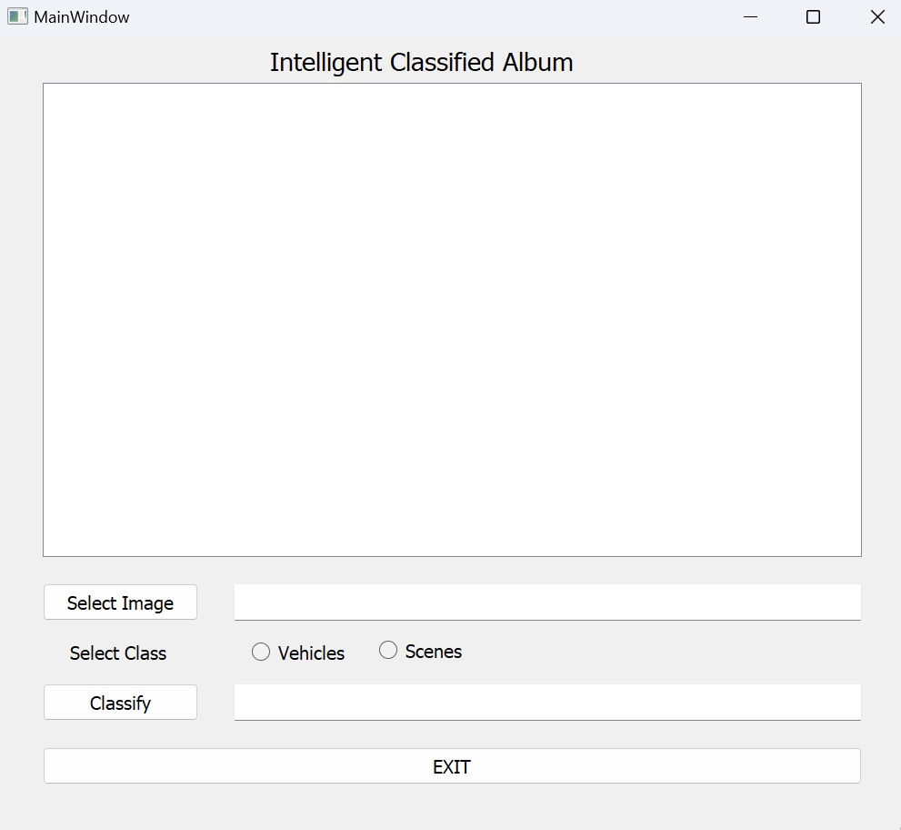

# Image Classification CNN with NumPy

[日本語](https://github.com/KanaMeisa/ImageClassifier-CNN/blob/master/READMEJP.md)

This is my assessment piece, a Convolutional Neural Network (CNN) constructed utilizing NumPy, accompanied by a Graphical User Interface (GUI) implemented through PyQt. The highlight and challenge of this project lie in the fact that the entire CNN is developed using NumPy, without reliance on any deep learning frameworks(PyTorch, TensorFlow, and so on). 

The program employs a CNN built with NumPy, realizing a compact neural network framework, encompassing a variety of layers in the CNN such as linear, convolutional, and pooling layers, along with activation functions like ReLu, Sigmoid, Softmax, and the cross-entropy loss function. This project proves invaluable for those seeking to grasp the fundamental logic behind CNNs.

## CNN Framework

## Database1: Vehicles

## Database2: Scenes

## GUI

